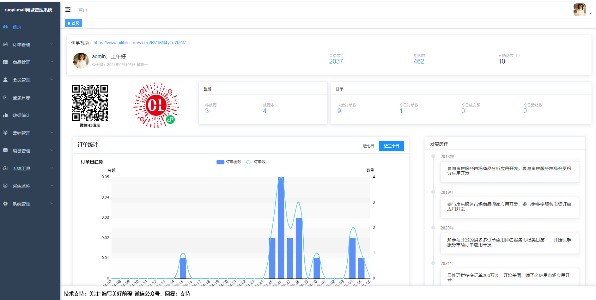
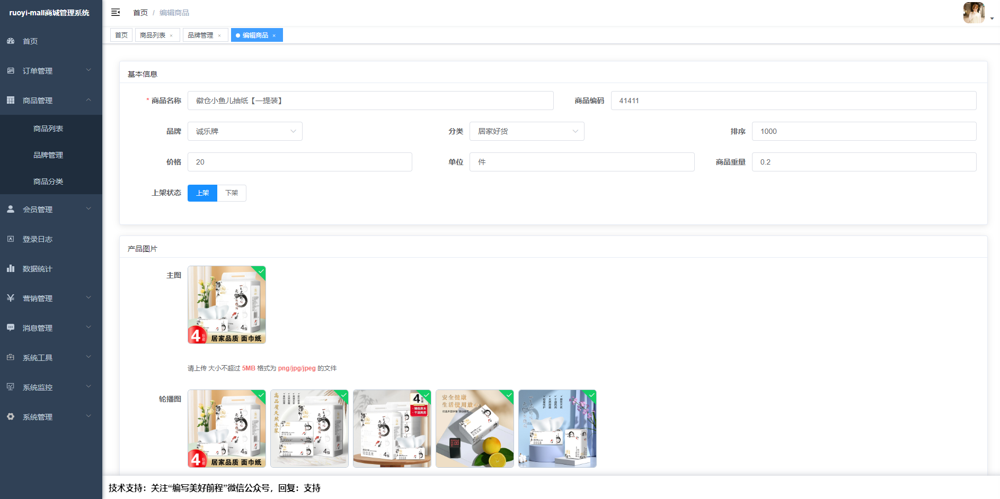
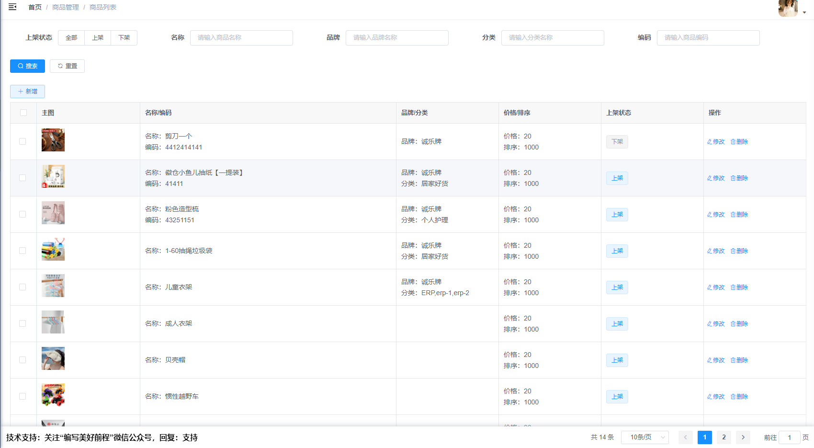
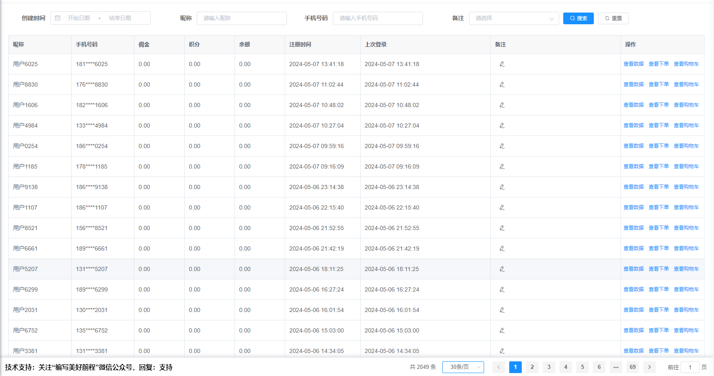
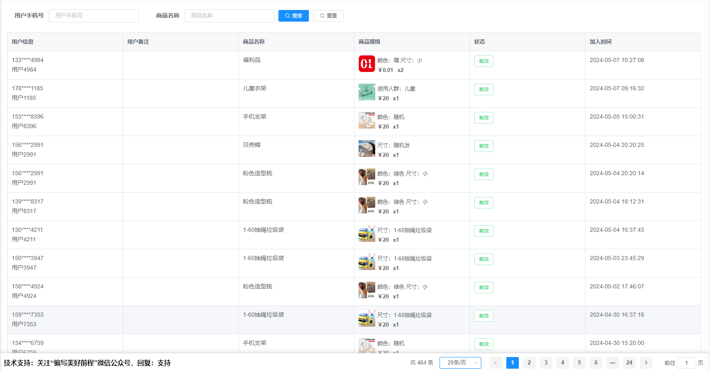
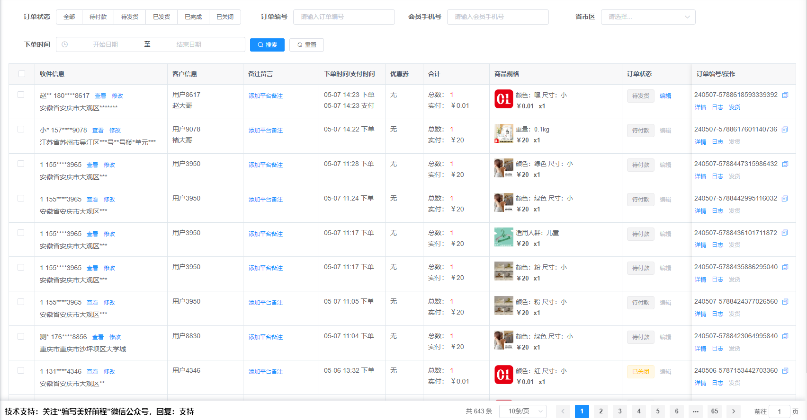
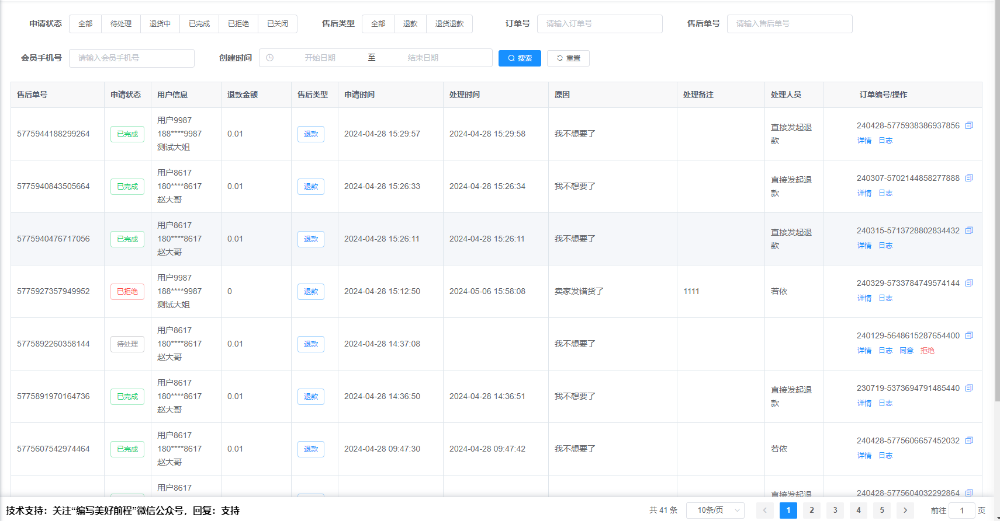
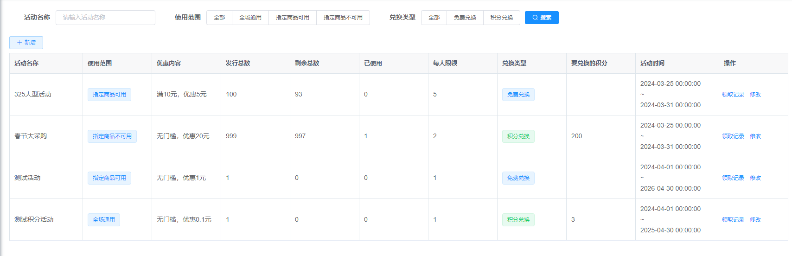
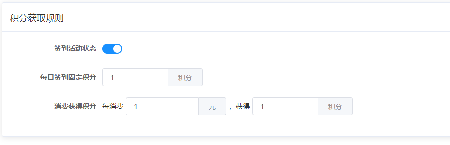
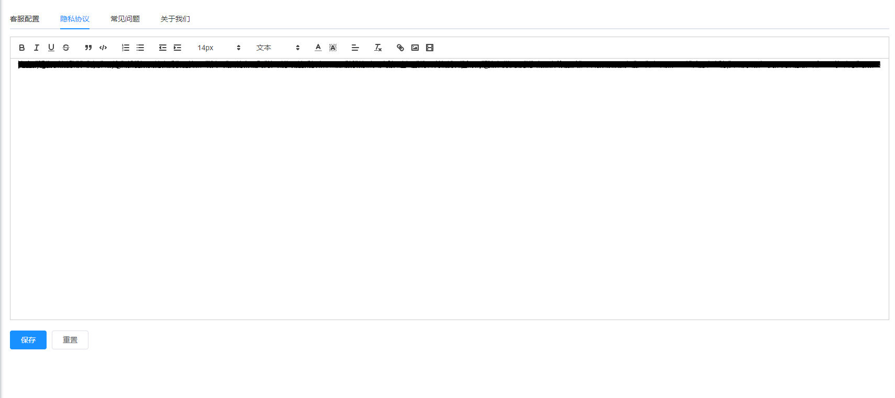

## 平台简介

若依是一套全部开源的快速开发平台，毫无保留给个人及企业免费使用。我们在此基础上开发了ruoyi-mall，希望能给做商城的朋友减轻工作量。

* 前端采用Vue、Element UI。
* 后端采用Spring Boot、Spring Security、Redis & Jwt。
* 权限认证使用Jwt，支持多终端认证系统。
* 支持加载动态权限菜单，多方式轻松权限控制。
* 高效率开发，使用代码生成器可以一键生成前后端代码。

## B站讲解视频
https://www.bilibili.com/video/BV16N4y1d7MM
## 若依视频教程
对若依框架不了解，不知道怎么部署、修改密码等操作的，请参考：https://www.bilibili.com/video/BV1Fi4y1q74p/
## 本地运行文档
https://docs.ichengle.top/mall/run.html
## 系统部署文档
https://docs.ichengle.top/mall/ops.html
## 特别注意
jdk请选择1.8~11之间的，不然mybaties会报错

## 项目地址
|                | gitee                                   | github                                       |
|:--------------:|:----------------------------------------|:---------------------------------------------|
| 管理端vue element | https://gitee.com/zccbbg/ruoyi-mall-vue | https://github.com/zccbbg/ruoyi-mall-vue     |
|   h5 uniapp    | https://gitee.com/zccbbg/ruoyi-mall-uniapp | https://github.com/zccbbg/ruoyi-mall-uniapp  |

## 在线体验
### 管理后台演示地址
http://mall.ichengle.top
### 小程序和h5

## 若依技术专栏
- 常见问题：https://blog.csdn.net/qq_27575627/category_12336113.html
- 后端技术：https://blog.csdn.net/qq_27575627/category_12331868.html
- 前端技术：https://blog.csdn.net/qq_27575627/category_12331867.html
- 运维：https://blog.csdn.net/qq_27575627/category_12332546.html

## 若依mall功能
1. 首页：

2. PMS商品管理：
   
   
3. UMS会员管理：
会员列表：

购物车：

4. OMS订单管理：
订单列表：

售后列表：
   
5. SMS营销管理：

   
6. CMS内容管理：

## 科技企业招聘、内推渠道
如果投简历经常已读不回，可以试试这个小程序，回复率相对高一点：

## 交流群/技术支持
|                    公众号                     |
|:------------------------------------------:|
|  |
扫公众号二维码，关注后，回复：“加群”